This blog is just a quick summary of the book [Ray Tracing in One Weekend](https://raytracing.github.io/books/RayTracingInOneWeekend.htmlRay)

Github Source Code: [prabhavdogra/ray_tracer](https://github.com/prabhavdogra/ray_tracer)

## What're we gonna make?

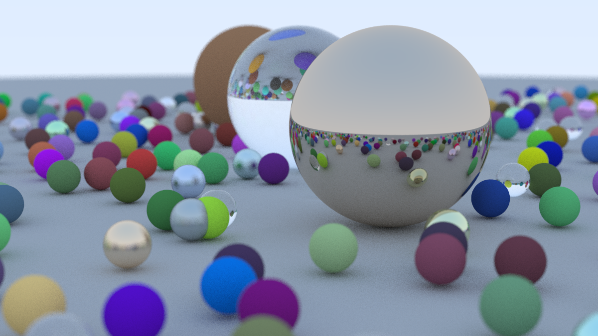

## Milestone 1:
Before starting anything, in this milestone we just create a sample image. To do that we use one of the simplest formats **P3**. **P3** is a plain text format for **Portable Pixmap (PPM)** image files. It is one of the simplest image formats, where pixel data is represented in plain text.

### P3 Image Format
In P3, each pixel is defined by three integers corresponding to the red, green, and blue color channels. The first line of the output is "P3", identifying the file format. The second line contains the width and height of the image. The third line specifies the maximum color value (typically 255, representing the maximum intensity for each color channel).
Each subsequent line contains three integers (r, g, b) for each pixel's color in the image.

```text title="Sample P3 image of width 2 pixels and height 3 pixels"
P3           // Defining format
2 3          // Width and Height
255          // Maximum color value
2 5 15       // (r, g, b) color intensity triplets
0 255 255    // (r, g, b) color intensity triplets
255 0 255    // (r, g, b) color intensity triplets
255 255 0    // (r, g, b) color intensity triplets
0 0 0        // (r, g, b) color intensity triplets
255 255 255  // (r, g, b) color intensity triplets
```
This image looks like: &nbsp; &nbsp; &nbsp; 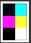

### Milestone 1 Results
We write a simple loop to render this:

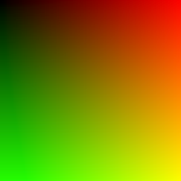


## Milestone 2:
In this milestone we setup a basic ray tracing setup. 
- We setup a sphere in the scene.
- We setup light rays that detects object in the scene.
- On the basis of intersection of light rays and objects in the scene it detects what each pixel in the image should look like.
- Set up vector ray header files

### How it works?
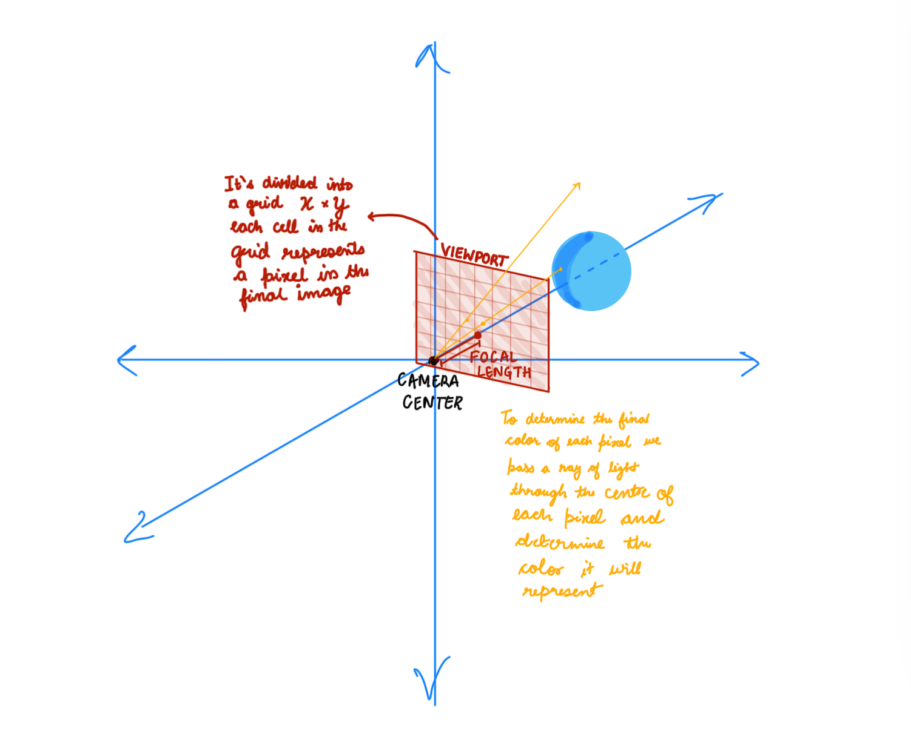
This image represents the basic concept of a ray-tracing camera model used in computer graphics and rendering. Let’s break it down step by step:

* **Camera and Viewport Setup**: The camera center is the origin of the coordinate system. A viewport (camera screen/a plane) is placed in front of the camera at a certain focal length. The viewport is divided into a grid of pixels (X × Y), where each cell represents a pixel in the final rendered image.

* **Ray Tracing Process:** For each pixel in the viewport grid
    - A ray of light is cast from the camera center through the center of the pixel.
    - The ray travels in the scene and intersects with objects (like the blue sphere in the diagram).
    - If a ray hits an object, the rendering algorithm calculates the color of that pixel based on:
        - The material properties (color, reflectivity, transparency).
        - Lighting conditions (shadows, reflections, refractions).
        - Camera perspective.
    - The computed color is assigned to the corresponding pixel in the final image.

### Sphere-Ray Intersection
This section explains the mathematical derivation for determining the intersection points between a ray and a sphere.

**Sphere Equations**

* **Sphere centered at (0, 0, 0):**
    * `x² + y² + z² = r²`
* **Sphere centered at (Cx, Cy, Cz):**
    * `(Cx - x)² + (Cy - y)² + (Cz - z)² = r²`

**Vector and Distance**

* **Vector from point A(x1, y1, z1) to B(x2, y2, z2):**
    * `(B - A) = (x2 - x1, y2 - y1, z2 - z1)`
* **Distance between points A and B:**
    * `d = √[(x2 - x1)² + (y2 - y1)² + (z2 - z1)²]`
* **Vector from point P(x, y, z) to center C(Cx, Cy, Cz):**
    * `(C - P) = (Cx - x, Cy - y, Cz - z)`

**Point on Sphere Condition**

For point P to lie on the sphere, it must be 'r' (radius) distance from the center:

* `(C - P) ⋅ (C - P) = (Cx - x)² + (Cy - y)² + (Cz - z)²`
* `(Cx - x)² + (Cy - y)² + (Cz - z)² = r²` (Distance from center)
* Therefore: `(C - P) ⋅ (C - P) = r²`

**Ray Equation**

* **General ray equation:** `RAY(t) = M * t + N`
    * `M` is the ray's direction vector.
    * `N` is the ray's origin point.

**Ray-Sphere Intersection**

A ray hits the sphere when it's 'r' distance from the center:

* `(C - RAY(t)) ⋅ (C - RAY(t)) = r²`
* `(C - (M * t + N)) ⋅ (C - (M * t + N)) = r²`
* Expanding the equation:
    * `t² * M ⋅ M - 2 * t * M ⋅ (C - N) + (C - N) ⋅ (C - N) - r² = 0`

**Quadratic Formula**

Using the quadratic formula (`roots = -b ± √(b² - 4ac) / 2a`), we get:

* `a = M ⋅ M`
* `b = -2 * M ⋅ (C - N)`
* `c = (C - N) ⋅ (C - N) - r²`

By solving this quadratic equation for 't', we can find the intersection points (if any) between the ray and the sphere.

### Milestone 2 Results
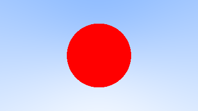

## Milestone 3:
- Scene Abstraction:
    - Introduced a Scene structure to manage all objects, lights, and properties in the environment.
    - Simplifies the rendering process by treating the scene as a collection of objects instead of handling each separately.

**Result:** The code is cleaner, modular, and easier to extend in the future (e.g., adding reflections, refractions, and different shapes).

### Milestone 3 Results
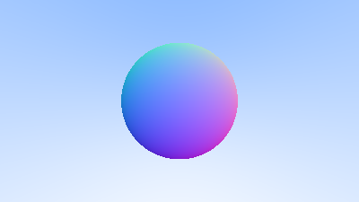

## Milestone 4:
**Rendering Improvements**  
- **Added Anti-Aliasing**  
  - Reduced jagged edges in the final image by averaging multiple rays per pixel.
- **Added Camera Class**  
  - Abstracted camera logic for better scene control.
- **Started Considering Reflected Rays**  
  - Introduced initial logic for reflection to create mirror-like surfaces.  
  - Prepares the system for handling realistic light behavior.

**Material System Enhancements**  
- **Added Material Class for Diffuse Material**  
  - Defined a reusable `Material` class to manage object properties.  
  - Simplified code structure by encapsulating material behavior.  
- **Added Material Class with Diffuse Material**  
  - Implemented Lambertian reflection for diffuse surfaces.  
  - Ensures objects interact naturally with light sources.  
- **Added True Lambertian Reflection**  
  - Improved light scattering on rough surfaces.  
  - Used a more accurate random sampling technique for diffuse reflections.
- **Gamma Correction**
  - Gamma Correction for More Realistic Colors


### Anti-aliasing
- Reduced jagged edges in the final image by averaging multiple rays per pixel.
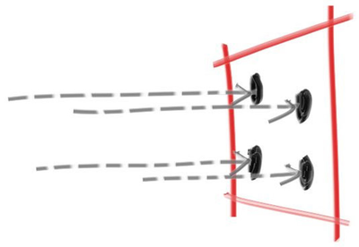

### A Simple Diffuse Material

A diffuse surface is a surface that scatters light in many directions instead of reflecting it in a single, well-defined direction (like a mirror). This happens because the surface is rough at a microscopic level.

* Some observations:
  * A light ray that bounces of a diffuse surface has equal probability of bouncing in all directions
  * They might also be absorbed rather than reflected. The darker the surface, the more likely the ray is absorbed (that’s why it's dark!). 


- How we will do it:
  - Generate a random vector inside the unit sphere
  - Normalize this vector to extend it to the sphere surface
  - Invert the normalized vector if it falls onto the wrong hemisphere

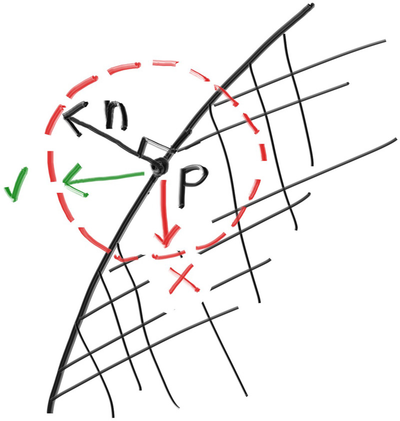

### True Lambertian Reflection

A more accurate representation of real diffuse objects is the Lambertian distribution. This distribution scatters reflected rays in a manner that is proportional to cos(𝜙), where 𝜙 is the angle between the reflected ray and the surface normal.

This means that a reflected ray is most likely to scatter in a direction near the surface normal, and less likely to scatter in directions away from the normal.
We do this by

```c title="src/v4/camera.h"
    // rec.normal is the normal to the hemisphere
    vec3 direction = rec.normal + random_unit_vector();
```
### Gamma Correction
* Gamma Correction for More Realistic Colors
  * Raw pixel values in the renderer are stored in linear color space.
  * Most displays, however, interpret color values in a non-linear way, requiring gamma correction.
  * Gamma correction is applied using the equation:
  ```
  corrected color = raw color ^ (¹⁄ᵧ)
  ```
  where **γ** (gamma) is typically **2.2**.  

## Milestone 5:
**Metal**
- Add a new class to **Material class** for **Metal object**
- Modelled light scatter and **reflectance**, enabling realistic surfaces.
- Added **mirrored light reflection** for metallic objects.
- Implemented **fuzzy reflection**, simulating rough metallic finishes.

**Dielectrics**
* Explored refraction and how light bends through transparent materials.
* Used **Snell’s Law** to determine how rays change direction at surfaces.
* Introduced **total internal reflection**, where light stays within the medium.
* Implemented the **Schlick Approximation** for **realistic reflection intensity**.

**Positionable Camera**
- Defines camera viewing geometry for perspective accuracy.
- Introduces controls for positioning and orienting the camera, improving scene setup.

### Metallic Surfaces and Reflective Rays
Introduces metallic materials by modifying how rays bounce off surfaces.
Reflection is modeled using the equation:
```
𝑅 = 𝑉 − 2 (𝑉 ⋅ 𝑁) 𝑁 
```

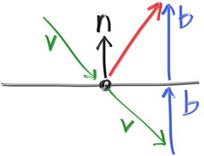
* Where,
    * **𝑅** is the reflected ray,
    * **𝑉** is the incoming ray, and 
    * **𝑁** is the surface normal.
The reflected ray is traced to determine the color contribution from the metal.

- Fuzziness in Reflection:
  - To simulate rough metal, a fuzziness parameter is introduced.
  - Instead of perfect reflection, a small random offset is added to the reflected ray direction.
  - The amount of fuzziness controls how polished or rough the surface appears.

### Dielectrics

Clear materials such as water, glass, and diamond are dielectrics. When a light ray hits them, it splits into a reflected ray and a refracted (transmitted) ray. We’ll handle that by randomly choosing between reflection and refraction, only generating one scattered ray per interaction.

### Snell's Law
Where 𝜃 and 𝜃′ are the angles from the normal, and 𝜂 and 𝜂′ are the refractive indices. The geometry is:
```
⇒ 𝜂 ⋅ sin𝜃 = 𝜂′ ⋅ sin𝜃′
```
where:  
- **𝜂** — Refractive index of the first medium  
- **𝜂′** — Refractive index of the second medium  
- **𝜃** — Incident angle (angle between the incoming ray and the normal)  
- **𝜃′** — Refracted angle (angle between the refracted ray and the normal)  

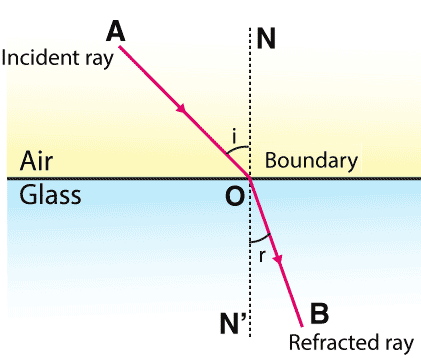

### Total Internal Reflection

Total Internal Reflection (TIR) occurs when light traveling from a **denser medium** to a **less dense medium** is **completely reflected** rather than refracted. This happens when the **angle of incidence** exceeds the **critical angle**, given by:

```
theta = sin⁻¹(n₂ / n₁)
```

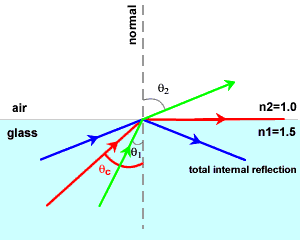

### Schlick's Approximation

Schlick's Approximation provides an efficient way to estimate **reflectance** at the interface of two materials based on the **angle of incidence**. 

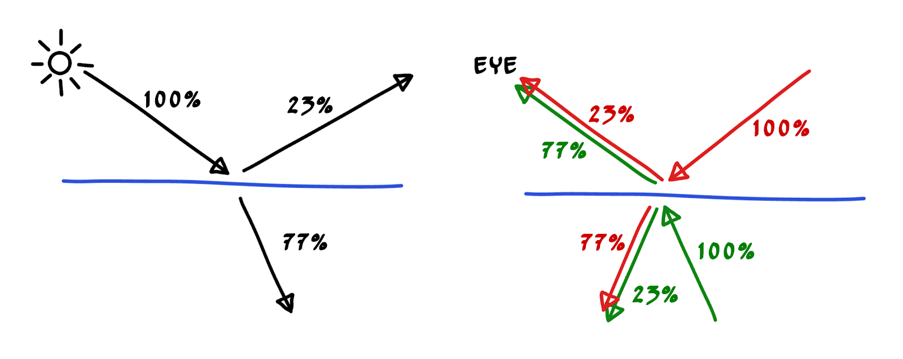

```
R₀ = ((n₁ - n₂) / (n₁ + n₂))²
```
This approximation avoids expensive computations while providing visually accurate reflections.

### Final Render

