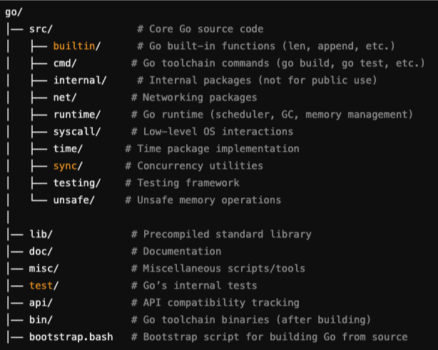

### Introduction
This question popped up in my head, _"How Go atomic operations avoid race conditions?"_

I finally gathered the courage to open the cloned [Go Github repo](https://github.com/golang/go) and scan through it.

I went inside the implementation of `CompareAndSwapInt32` and found this:

```go
// CompareAndSwapInt32 executes the compare-and-swap operation for an int32 value.
// Consider using the more ergonomic and less error-prone [Int32.CompareAndSwap] instead.
//
//go:noescape
func CompareAndSwapInt32(addr *int32, old, new int32) (swapped bool)
```

Finding the implementation of this was not straightforward, because this methods is implemented in Go Assembly:
```go title="src/sync/atomic/asm.s"
TEXT ·CompareAndSwapInt32(SB),NOSPLIT,$0
	JMP	internal∕runtime∕atomic·Cas(SB)
```


### Go Code Structure 


_Source: ChatGPT_

### What's Go Assembly?
Simply put, **Go Assembly** is the low-level language used to write performance-critical functions in Go.
**Go Assembler** (Code directory path: cmd/asm) is the tool that compiles **Go assembly (.s) files** into machine code.
The Go assembler was heavily inspired by the [Plan 9 C compilers](https://9p.io/sys/doc/compiler.html).

:::note Plan 9 C compilers
**Plan 9 C compilers (6c, 8c, 5c, etc.)** were architecture-specific compilers designed to generate optimized code for different CPU architectures. Unlike GCC or LLVM, which support multiple architectures within a single compiler framework, Plan 9 used separate compilers for different instruction sets. These compilers were originally developed for the Plan 9 operating system, an experimental OS designed as a potential successor to Unix-based systems.

You can read more about it here: [https://9p.io/sys/doc/compiler.html](https://9p.io/sys/doc/compiler.html)
:::

Go drew inspiration from 9 C Compiler:
- Just like **Plan 9** had **separate compilers** for **different architectures** (e.g., 6c for x86-64, 8c for ARM, etc.).
- Go’s assembler follows a similar architecture-based approach, instead of a universal assembler Go has different assemblers for x86, ARM, RISC-V, etc.

You can watch this, an interesting talk about [Go Assembler](https://www.youtube.com/watch?v=KINIAgRpkDA) presented by Rob Pike himself.

[Go Assembler Documentation](https://go.dev/doc/asm)

Go Assembler streamlined a lot of things:
- **Portability:** It abstracts CPU architecture details better.
- **Simpler syntax:** No need for % prefixes, brackets, or complex addressing.
- **Unified across architectures:** ARM, AMD64, RISC-V, etc., use the same structure.
- **Designed for the Go runtime:** Helps implement Go features like garbage collection, goroutines, and stack growth efficiently.


Go Assembler has 4 architecture-specific implementations of `atomic.CompareAndSwapInt32()`:
- **amd64.s**: For AMD64 (x86-64) architecture (Intel, AMD CPUs).
- **arm64.s:** For ARM64 (AArch64) processors (used in Apple M1/M2, mobile devices, servers).
- **ppc64le.s:** For PowerPC 64-bit, Little Endian (used in IBM systems).
- **s390x.s:** For IBM Z-series mainframes (used in enterprise computing).

Go runs on multiple architectures, and low-level atomic operations must be natively implemented for each to ensure compatibility.

Added the implementations for one architecture (other 3 are similar) in Go Assembly:


```go title="src/internal/runtime/atomic/atomic_amd64.s"
// bool Cas(int32 *val, int32 old, int32 new)
// Atomically:
//	if(*val == old){
//		*val = new;
//		return 1;
//	} else
//		return 0;
//  }
TEXT ·Cas(SB),NOSPLIT,$0-17
	MOVQ	ptr+0(FP), BX
	MOVL	old+8(FP), AX
	MOVL	new+12(FP), CX
	LOCK
	CMPXCHGL	CX, 0(BX)
	SETEQ	ret+16(FP)
	RET
```
Explaining this line by line how this maintains atomicity.

```go
TEXT ·Cas(SB),NOSPLIT,$0-17
```
- `TEXT ·Cas(SB)`: Declares the function Cas(CompareAndSwap) in Go assembly.
- `NOSPLIT`: Instructs the runtime not to perform stack splitting, ensuring that the function runs without interruption. It tells the Go runtime not to perform stack splitting for that function. 
- `$0-17:` Specifies the stack frame size for the function (0 bytes for local variables and 17 bytes for arguments/return values).


```go
MOVQ ptr+0(FP), BX:
```
- Moves the pointer `ptr` (the address of val) from the function's frame pointer (FP) into the `BX` register.
```go
MOVL old+8(FP), AX:
```
- Moves the old value from the frame pointer into the `AX` register.
```go
MOVL new+12(FP), CX:
```
- Moves the new value from the frame pointer into the `CX` register.
```go
LOCK:
```
- This is a crucial instruction. It prefixes the next instruction (CMPXCHGL) with a lock, ensuring that the memory operation is atomic. This lock ensures that no other process or thread can modify the memory location while the compare and exchange instruction is running.
```go
CMPXCHGL CX, 0(BX):
```
- This is the Compare and Exchange instruction. It performs the following:
	- Compares the value in AX (the old value) with the value at the memory location pointed to by BX (the val value).
	- If the values are equal, it replaces the value at 0(BX) with the value in CX (the new value).
	- The original value at 0(BX) is loaded into the AX register.
```go
SETEQ ret+16(FP):
```
- SETEQ sets the byte at the destination to 1 if the zero flag is set, and to 0 otherwise. In this case, it sets the return value to 1 if the comparison was equal (meaning the swap was successful), and to 0 otherwise.
```go
RET:
```
- Returns from the function


### Conclusion

At the register level, atomicity is achieved because:
- The LOCK prefix serializes access across CPU cores.
- CMPXCHGL ensures all three steps (compare, swap, write-back) happen as one unit.
- The CPU guarantees atomicity, eliminating race conditions without software locks.
